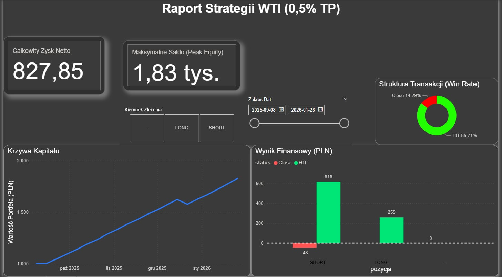
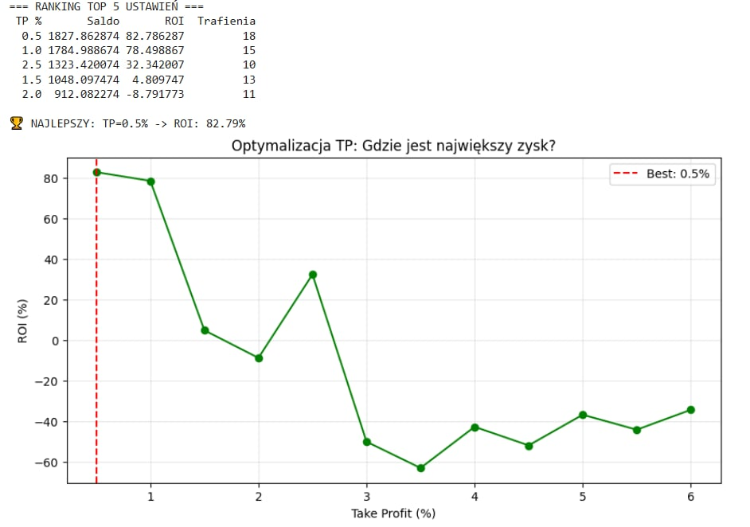

# WTI Crude Oil - Algorithmic Trading Strategy


## Motivation
As a Data Analysis student interested in financial markets, I wanted to build a project that goes beyond standard datasets. My goal was to create a full data pipeline: from extracting broker data, processing it in Python & SQL, to a final dashboard in Power BI.

This project simulates a Quantitative Strategy on WTI Oil, testing if we can gain an edge by following institutional financing costs (Swap Rates).

## Project Overview
Instead of relying solely on technical analysis, this algorithm exploits Swap Rate differentials to identify short-term market bias.

The goal was to simulate, optimize, and visualize a strategy that aligns with institutional money flow, targeting a specific 0.5% Take Profit (Scalping).

## Dashboard Preview
Interactive Power BI Dashboard validating the strategy performance.



---

## The Strategy: Institutional Hedging Pressure
The core logic is based on the **Institutional Conviction** concept (following the "smart money" cost).

1.  **Signal Generation:** The Python script monitors the `Swap Rate Delta`.
    * **Logic:** If the cost of holding a position **increases** (Swap becomes more negative/expensive), the algorithm treats it as a signal of **High Conviction**.
    * *Rationale:* If institutions are willing to pay a premium to hold a SHORT position, it indicates strong bearish sentiment and hedging pressure.
2.  **Execution (Contrarian Flow):**
    * We enter the market in the direction where the "holding cost" is rising, following the institutional volume.
    * **Take Profit:** Fixed at 0.5% to capitalize on the expected momentum.
    * **Risk Management:** Position sizing is calibrated (0.93 Lot) to match a specific risk profile.

### Analysis Pipeline (The Tech Stack)
The strategy data flows through Python, is stored/queried in SQL, and verified in Excel.

| 1. Python Simulation | 2. SQL Data Warehousing | 3. Excel Verification |
| :---: | :---: | :---: |
|  |  |  |

## Project Structure
The repository is organized to simulate a production-grade data pipeline:

* `src/` - Contains the main Python simulation script (`main.py`).
* `data/` - Raw input data (XTB) and generated results (`.xlsx`).
* `images/` - Screenshots of the process (Python, SQL, Excel, Power BI).
* `requirements.txt` - Python dependencies.

## Key Results (Verified)
The simulation includes a Reconciliation Module that ensures the Python output matches the Power BI Dashboard exactly.

| Metric | Result |
| :--- | :--- |
| **Initial Capital** | 1,000.00 PLN |
| **Net Profit** | **+827.85 PLN** |
| **ROI** | **~82.7%** |
| **Verification** | Matches Dashboard & Excel Pivot Table |

## Tech Stack
* **Python (Pandas, NumPy):** Used for Data Cleaning (ETL), Backtesting Logic, and Financial Calculations.
* **Excel:** Used for intermediate verification and Pivot Table analysis.
* **Power BI:** Final interactive dashboard for performance visualization (Dark Mode).

## How to Run
1.  Clone the repository.
2.  Install dependencies:
    ```bash
    pip install -r requirements.txt
    ```
3.  Run the simulation:
    ```bash
    cd src
    python main.py
    ```
4.  The script will generate `wyniki_strategii_final.xlsx` in the root folder.

---
*Author: Krzysztof Mielewczyk * *Data Source: XTB (Historical Sample)*

